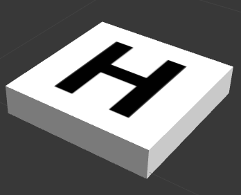

# precision_landing
Package to control MAVs using Computer Vision in order to land it.

## Dependencies
- [ROS Melodic](http://wiki.ros.org/melodic) 
- Python (tested on 2.7.17)
- [PX4 Firmware](https://github.com/SkyRats/Firmware.git)
- [mavbase](https://github.com/SkyRats/mavbase.git)

## Usage Instructions
### Precision landing on H with PID

1. Open a Gazebo world  
    The world must contain an air vehicle with a camera and a helipad, to have access to a world with these characteristics access the simulation directory.  
    **Obs:** [Simulation repository](https://github.com/SkyRats/simulation.git) contains all these 3D models that are needed to at leat test the code.
     
2. Run
   
```roslaunch precision_landing h_precision_landing```  
